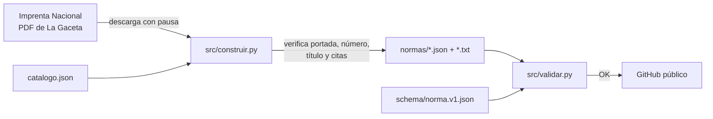

# Mapa del proyecto

| Componente | Responsabilidad | Estado |
|---|---|---|
| `catalogo.json` | Qué normas, en qué PDF, páginas, marcadores, relaciones y exclusiones | v1 (10 normas) |
| `src/construir.py` | Descarga, extracción por columnas, verificación bloqueante, generación | v1 |
| `src/validar.py` | QA independiente con autocomprobación (control negativo) | v1 |
| `schema/norma.v1.json` | Contrato de datos; no se edita una vez publicado | v1 |
| `.cache/gaceta/` | PDF descargados; no se publican | local |

Dependencias externas: sitio de la Imprenta Nacional (`www.imprentanacional.go.cr/pub/…`). Puntos de entrada:
`python src/construir.py`, `python src/validar.py`.
